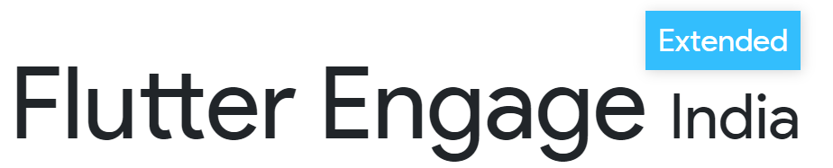

This repository contains the official website for the Flutter Engage event, organized by a mega-collaboration between 16 communities.

### Project Info

This project uses [React.Js](https://reactjs.org) and the contents are bundled using webpack.

The contents in this project follow the following structure.

```
├───public
│   └───images
│
└───src
    ├───assets
    │   ├───images
    │   │   └───communities
    │   └───rive
    ├───components
    │
    ├───helpers
    └───sections
        ├───communities
        ├───footer
        ├───hero
        └───schedule
```

Each individual section and component, contains two files

```
section
  ├──index.js
  └──style.scss
```

#### Constants

This project uses **'Product Sans'** as it's primary font, with weights of 400. All the fonts have been pre-imported.

Moreover, here are a few constants which are used throughout the project, and have been added to the root of css, use them accordingly.

```
  --color-base: white;
  --color-base-secondary: #e6e6e6;
  --color-primary: #025095;
  --color-highlight: #33befd;
  --color-text: #000000;
  --color-text-secondary: #5e5e5e;
```

## Setup

##### Clone the repository

```bash
git clone https://github.com/Flutter-India/flutter-engage-extended.git
```

##### Move to the desired folder

```bash
cd \flutter-engage-extended
```

##### To install the dependencies, simply write

```bash
yarn install
```

##### To run the app, simply write

```bash
yarn start
```

## Learn More

You can learn more in the [Create React App documentation](https://facebook.github.io/create-react-app/docs/getting-started).

To learn React, check out the [React documentation](https://reactjs.org/).

[](https://github.com/ishandeveloper)